# 概述

## UML是什么

**UML**是统一建模语言的简称，它是一种由一整套图表组成的标准化建模语言。UML用于帮助系统开发人员阐明，展示，构建和记录软件系统的产出。UML代表了一系列在大型而复杂系统建模中被证明是成功的做法，是开发面向对象软件和软件开发过程中非常重要的一部分。UML主要使用图形符号来表示软件项目的设计，使用UML可以帮助项目团队沟通、探索潜在的设计和验证软件的架构设计。

## 组成

### 事物

- 结构事物

结构事物是 UML 模型中的名称，用来表示模型静态部分，描述概念或物理元素。包括类(Class)、 接口(Class)、协作(Collaboration)、用例(Use Case)、主动类(Active Class)、构件(Component)、制品(Artifact)、结点(Node)

- 行为事物

行为事物是 UML 模型中的动态部分，用动词表示，描述跨越时间和空间的行为，包括交互 (Interaction)、状态机(State Machine)和活动(Activity)

- 分组事物

在所有的分组事物中，最主要的分组事物是包(Package)。包是把元素组织成组的机制，结构 事物、行为事物甚至其他分组事物都可以放进包内。

- 注释事物

注释事物是解释部分，用来描述、说明和标注模型的任何元素

### 关系

- 依赖
- 关联
- 泛化
- 实现

### 图

UML 包括 13 种不同的图，分为表示系统静态结构的静态模型（包括用例图、类图、对象图、构件图、部署图、组合结构图、 包图），以及表示系统动态结构的动态模型（包括顺序图，协作图，交互概览图、状态图，活动图，计时图）。

# 图

## 用例图

### 用例

用例表示系统的功能，一个用例是系统功能的通用描述

一个系统通常需要多个用例来描述系统需求

用例表示为一个椭圆

### 参与者

代表与系统交互的人，设备或者另一个系统。

通常用一个小人代替

### 用例图中的三种关系

#### 包含

当两个或多个用例中共用一组相同的动作，这时可以将这组相同的动作抽出来作为一个独立的用例(被包含用例)，供多个基础用例所共享。

因为共同行为用例被抽出，基用例并非一个完整的用例，所以 include 关系中的基用例在执行时，被包含用例也 必然被执行。

#### 扩展

extend 扩展关系用于分离不同的行为。

一个用例明显地混合了两种或者两种以上的不同场景，即依据情况可能发生多种分支，则 能够将这个用例分为一个基本用例和一个或多个扩展用例。

基础用例执行时，扩展用例不一定执行。

#### 泛化

generalize 将多个用例共有的结构和行为抽象出来作为原用例的父用例，父用例作为所有原用例的“泛化”表示，原用例作为泛化关系 的子用例。

在用例的泛化关系中，子用例是父用例的一种特殊形式(“is-a”关系)，它继承了父用例的全部结构、行为、关系， 用空心三角箭头指向父用例

### 用例图功能

用例图用于需求分析阶段，是软件系统后续开发的基础。

用例图用于对系统的静态用例视图进行建模，这个视图主要支持系统的行为。

即该系统在他的周边环境的遇境中所提供的外部可见服务。

## 类图

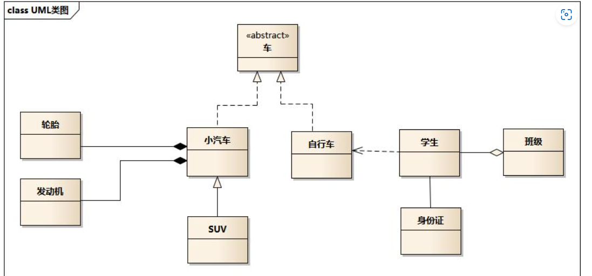

类图展现了一组对象、接口、协作和它们之间的关系。

类图给出了系统的静态设计视图，包含主动类的类图给出了系统的静态 进程视图。

对于一个想要描述的系统，其类模型和对象模型提示了系统的结构。类图通过包括：类、接口、协作、关系(依赖、泛 化、关联、实现)。

### 类

- 实体类
- 接口类
- 控制类

### 可见性

- **公有**可见性（+）：对能看到这个类的任何元素都可见。
- **保护**可见性（#）：对这个类及其子类的其他元素可见。
- **私有**可见性（-）：对这个类的其他元素可见。
- **包**可见性（~）：对同一个包中的其他元素可见。

### 类之间的关系

#### 依赖关系

依赖是两个事物之间的语义关系，其中一个事物发生变化会影响另一个事物的语义

**使用带箭头的虚线表示依赖关系**

-  A 类是 B 类的一个成员变量
-  A 类是 B 类方法中的一个参数
-  A 类向 B 类发送消息，从而影响 B 类发生变化
- B 类继承 A 类

依赖程度最高的是**继承**

#### 泛化关系

又叫做概括关系。就是父类与子类之间的关系。

**使用带空心箭头的实线表示，箭头指向父类**

继承关系是泛化关系的反关系。

#### 关联关系

关联（Association）表示两个类之间存在某种语义上的联系，描述一组对象之间连接的结构关系

关联关系一般都是双向的， 即关联的对象双方彼此都能与对方通信。

##### 普通关联

普通关联是最常见的一种关联。

只要类与类之间存在连接关系就可以用普通关联表示。

**普通关联的图标是一条直线**。

但当两个类有明确的指向性，或者作者意愿如此，**可以在关联关系中加入箭头**

##### 聚合关联

聚合（Aggregation）是一种特殊形式的关联。

聚合表示类之间的关系是整体与部分的关系（整体类和局部类无共同的生命周期）。

 **使用一个带空心的菱形的实线表示，空心菱形指向是代表“整体”的类**

##### 组合关联

又叫组装关系，是聚合的变种，也是关联的特例，其表示是一种“has -a”关系。

在一个组合关系中，一个对象一次只能是一个组合的一部分。

在组合关系中，“整体”负责“部分”的创建和破坏。

**使用带有实心菱形的实线表示。**

#### 实现关系

实现关系是用来规定接口和实现接口的类或组件之间的关系，其中的一个类指定了由另一个类保证执行的契约。

接口是操作的集合，这些操作用于规定类或组件的服务。

**使用一个带空心箭头的虚线表示**。

## 对象图

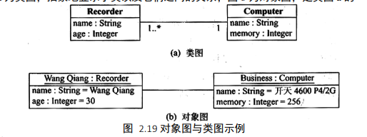

对象图展现了某一时刻一组对象以及它们之间的关系，描述了在类图中所建立的事物的实例的静态快照

-  边界对象 
- 实体对象
- 控制对象

以上的三种对象对应了 MVC 软件框架，MVC(Model-View-Controller，模型-视图-控制器)是一种软件设计典范，用一种业务 逻辑、数据、界面显示分离的方法组织代码，将业务逻辑聚集到一个部件里面，在改进和个性化定制界面及用户交互的同时，不需 要重新编写业务逻辑。

## 顺序图

又称 **序列图 时序图**

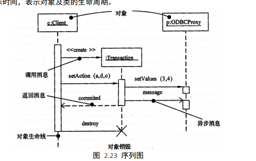

顺序图（Sequence Diagram）用来描述对象之间动态的交互关系，着重体现对象间消息传递的时间顺序。

顺序图允许直观地表 示出对象的生存期，在生存期内，对象可以对输入消息做出响应，并且可以发送消息。

**对象间的通信通过在对象生命线间画消息来表示。消息的箭头指明消息的类型**

**通过在对象生命线上显示一个细长矩形来表示激活**

### 消息类型

- 同步消息

如果发出了一条消息后，只能等待接收该消息的对方返回一个反馈消息以后才能产生其他的行为，此消息称为同 步消息

**实心三角箭头及实线表示**

- 异步消息

如果发出了一条消息后，不需要等待接收该消息的对方返回一个反馈消息便能进行与其他对象的交互，则此消息 称为异步消息

**空心箭头及实线表示**

- 返回消息

表示调用一个方法后返回的消息

**实心三角箭头及虚线表示**

## 通信图

又称 **协作图**

通信图用于描述相互合作的对象间的交互关系和链接关系，强调的是参与交互作用的对象的组织结构。

**虽然顺序图和协作图都是用来描述对象间的交互关系**，但侧重点不一样。

顺序图着重体现交互的时间顺序，协作图则着重体现交互对象间的静态链接关系 （对象的组织结构关系）

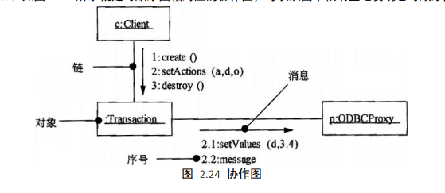

## 状态图

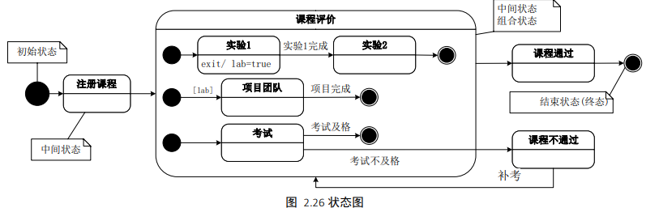

状态图（State Diagram）给出了一个状态机，用来描述一个特定对象的所有可能状态及其引起状态转移的事件，由状态、转换、 事件和活动组成，其关注系统的动态视图，对于接口、类和协作的行为建模尤为重要，强调对象行为的事件顺序

**大多数面向对象技术都用状态图表示单个对象在生命周期中的动态行为**

### 要素

* 椭圆或圆角矩形：表示对象的一种状态，椭圆内部填写状态名
* 箭头：表示从箭头出发的状态可以转换到箭头指向的状态；
* 事件：引起状态转换的原因，事件名可在箭头线上方标出
* 条件：事件名后加方括号，括号内写状态转换条件
* 实心圆：初始状态
* 内部实心的同心圆：最终状态

### 状态

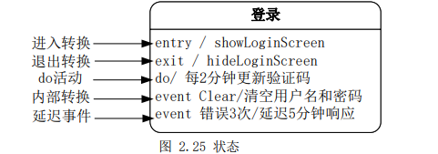

### 转换

转移是两个状态间的一种关系，表示对象将在当前状态中执行动作，并在某个特定事件发生或某个特定的条件满足时进入后继 状态，每个转移只允许有一个事件触发，一个事件只允许有一个动作

事件格式为：**事件(参数)[条件]/动作**，转换相关的五要素为：源状态、目标状态、触发事件(如果箭头上不带任何事件名，表示 是一个自动转换，当与源状态相关的活动完成时就会自动触发)、监护条件、动作

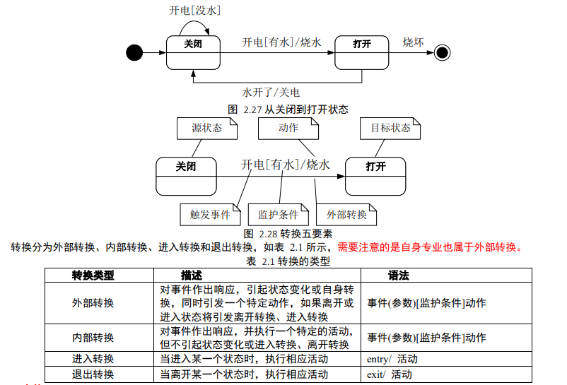

### 事件

事件是对一个时间和空间上占有一定位置的有意义的事情的规格说明，**事件触发状态的转移**。

有 4 类主要事件

- 信号事件
- 调用事件
- 变化事件
- 时间事件

## 活动图

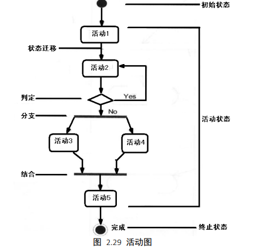

活动图是一种特殊的状态图，或称为**流程图**。

展现了在系统内从一个活动到另一个活动的流程，用于对系统的动态视图建模， 强调对象之间的控制流程。

使用活动图的场合：对工作流建模、对操作建模

### 组成元素

- 动作状态
- 活动状态
- 转移
- 分支
- 分叉
- 联结
- 泳道
- 对象流

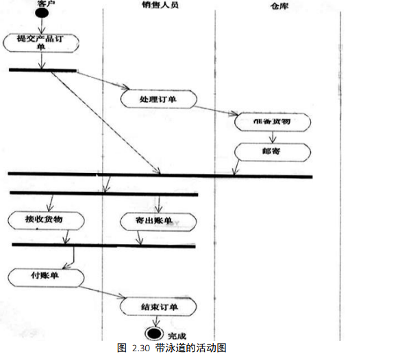

## 构件图

描述了组件和组件之间的组织和依赖关系，它用来模拟系统的静态实现，是面向对象系统的物理方面进行建模时要用的两种图 之一。

通常构件指的是源代码文件、二进制代码文件和可执行文件等

而构件图就是用来显示编译、链接或执行构件之间的依赖关系

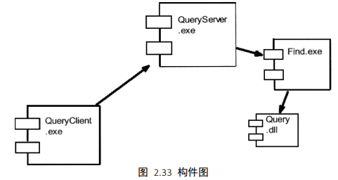

## 部署图

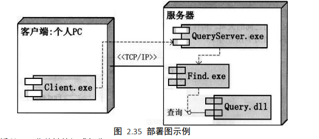

部署图，也称为实施图或配置图，显示了基于计算机系统的物理系统结构

它和构件图一样，是面向对象系统的物理方面建模 的两种图之一

## 交互概览图

交互概览图是交互图与活动图的混合物，可以把交互概览图理解为细化的活动图

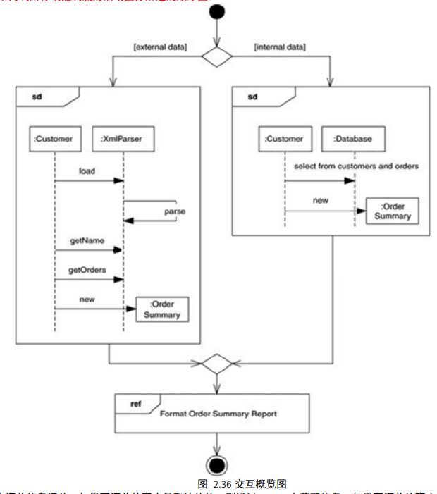

## 计时图

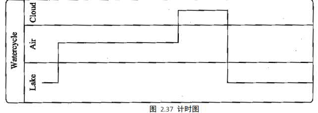

计时图是适合实时和嵌入式系统建模的交互图，关注沿着线性时间轴、生命线内部和生命线之间的条件改变，描述对象状态随 着时间改变情况，很像示波器，适合分析周期和非周期性任务

## 组合结构图

组合结构图用于描述一个分类器(类、构件或用例)的内部结构，分类器与系统中其他组成部分之间的交互端口，展示一组相互 协作的实例如何完成特定的任务，描述设计、架构模式或策略

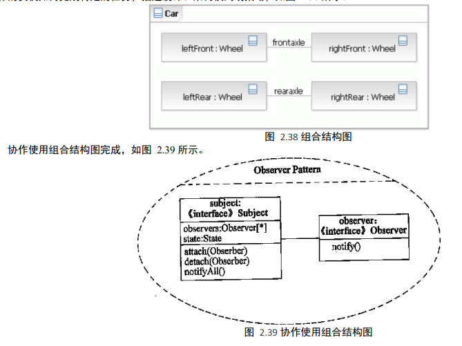

## 包图

包图是用于把模型本身组织成层次结构的通用机制，不能执行，展现由模型本身分解而成的组织单元以及其间的依赖关系，包 中可包含类、接口、构件、结点、协作、用例和图，甚至嵌套其他包等

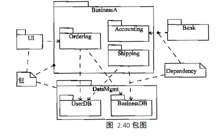

# 图的总结

