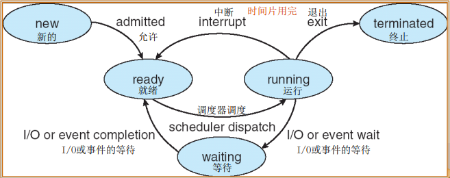
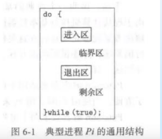

# 操作系统
- 定义
  - 操作系统是一组有效组织和管理计算机硬件和软件资源，合理地对各类作业进行调度，以及方便用户使用程序的集合
- 功能
  1. 进程管理
  2. 存储管理
  3. 设备管理
  4. 文件管理
  5. 作业管理

## 进程管理

### 程序与进程

#### 区别

- 程序是静态的，存在于外存中，是一系列指令的集合的实体
- 进程是动态的，存在与内存中，是程序的虚拟，具有生命周期的实体

### 进程的组成

- 程序
- 数据
- **进程控制块** *PCB 进程存在的唯一标志*

### 进程状态

- new
- ready
- running
- waiting
- terminated
- 

### 进程抢占调度方式

- **FCFS** *First-Come First-Served  先到先服务*
- **SJF** *Shortest-Job-First 最短作业优先*
- **RR** *Round-Robin 时间片轮转*
- **优先级调度算法**
- **多级队列调度**

## 线程

- 引入进程的目的
  - 为了使多个程序并发执行，以提高资源利用率和系统吞吐量
- 引入线程的目的
  - 为了减少程序再并发执行时所付出的时空开销，使OS具有更好的并发性

**线程是CPU使用的基本单元，也是作为调度和分配的基本单位，同一进程的其他线程共享代码段，数据段和其他操作系统资源**

## 同步与互斥

### 概念

- 进程间的同步

​		在相互合作关系的进程间，相互合作的进程需要在某些确定点上协调它们的工作，当 一个进程到达了这些点后，除非另一进程已经完成了某些操作，否则就不得不停下来等待这些操作结束。

- 进程间的互斥

​		当进程间存在资源共享关系时，如共享CPU等，系统就需要统一的分配资源，保证进程 间能互斥的访问这些资源，这种关系就是进程间的互斥。

### 临界区与临界资源

**临界资源** *在多道程序系统中，一次只能供-个进程使用的资源，称为临界资源(critical resource，CR)， 如打印机。*

### 信号量

- 计数信号量
  - 默认值为0 若大于0表示可用的资源数量，小于0则表示死锁的进程数量
  - 当执行申请资源wait时减一
  - 当释放资源Signal时加一 
- 二进制信号量
  - P-V信号	P ***wait***  V ***signal***

### 经典同步问题

#### 生产者消费者问题

#### 读者-写者问题

#### 哲学家就餐问题

## 进程的死锁

多个进程因竞争资源而造成的一种僵局，若无外力作用，这些进程都无法继续运行下去

### 产生原因

1. 资源竞争
2. 进程间执行顺序非法

### 产生的必要条件

1.  资源互斥 **mutual exclusion**
2. 占有并等待 **hold and wait**
3. 非抢占 **no preemption**
4. 循环等待 **circular wait**

### 死锁的处理

#### 预防死锁

*预防方法为破除死锁产生的四个必要条件之一*

#### 避免死锁

系统的状态分为安全状态和不安全状态 安全状态是指系统按照某种安全的顺序为每个进程分配资源，该按照顺序执行的程序序列称为**安全序列**，计算安全序列的算法 有**银行家算法**

#### 检测死锁

#### 解除死锁

- 进程终止
  - 中止所有死锁进程
  - 一次终止一个进程直到消除死锁循环为止
- 资源抢占
  - 选择牺牲进程
  - 回滚
  - 防止饥饿产生

### 银行家算法

在运行过程中，合理分配资源数以避免死锁的发生。 当一个进程对资源的最大需求量不超过系统中的资源数时可以接纳该进程。

- Available 表示每种资源的可用的实例数
- MAX 表示每个进程的最大需求
- Allocation 表示每个进程已分配的实例数
- Need 表示每个进程所需的实例数 = Max - Allocation

#### 资源请求

Request 表示进程请求的资源数

仅当 Request <= Need 且 Request <= Available 时可以分配资源

#### 安全序列

Work 表示当前系统可分配资源数

初始化 Work = Available

Finish 表示进程完成的状态

仅当 Work >= Need 时可以将Finish置为True

当所有的进程Finish=True时，那么这个系统有一个安全序列，系统是安全的 

## 存储管理

### 存储设备

- 主存储器  *内存或主存*
- 寄存器 
- 高速缓存
- 磁盘缓存

###  连续空间分配存储管理

- 单一连续分区 *仅用在早期单用户单任务的操作系统中。将内存分为系统区和用户区*
- 固定分区 ***静态分区方式，将主存分为若干分区，可大小不等***
- 动态分区 ***动态分区分配是根据进程的实际需要，动态地为之分配内存空间***
- 可重定位分区 *解决碎片问题 **移动已分配好的分区使之成为连续空间***

#### 动态内存分配算法

- 首次适应算法 
- 循环首次适应算法
- 最佳适应算法 ***将内存分片由小到大排序***
- 最坏适应算法
- 快速适应算法 *分类搜索法*

### 分页存储管理

**将逻辑内存分为若干等大小的区域，称为*页***  也称帧

系统为了保证每个页找到对应的物理块，所建立的映射表称为 ***页表*** 

系统会将一些经常访问的地址存储到寄存器中 称为 **快表 TLB**

#### 存储的地址结构

**页码+页偏移** 

页大小可以从512B到1GB不等

#### 命中率

在TLB中查找到感兴趣的页码的次数的百分比

### 分段存储管理

**分页与分段的主要区别在于分段将存储空间划分不等的空间**

### 段页式存储管理

分页和分段存储管理方式都各有其优缺点。分页系统能有效地提高内存利用率，而分段系统则 能很好地满足用户需要。 

### 页面置换算法

#### 页面置换

物理内存空间有限，当需求过高时会对内存中的资源反复引用，若当前内存中没有某资源，则内存会从硬盘中读取该资源，从而产生页面置换，但页面置换会消耗更多时间。所有页面置换算法旨在减少未来的页面置换，及减少缺页率。

缺页 指调用资源时，未在内存中发现，而后通过页面置换成功调用的过程。注意：有些题目并不包括置换出空闲帧的情况。

#### FIFO 先进先出算法

即选择在内存中驻留时间最久的页面予以淘汰

#### LRU 最近最少使用算法

该算法赋予每一个页面访问字段，用来记录一个页面自上次被访问以来所经历的时间 t，当需要淘汰一个页 面时，选择现有页面中 t 值最大的，即最近最久未使用的页面予以淘汰。

#### OPT 最优页面算法

该算法因需要提前预测系统调用的资源，理论上无法实现。

其所选择淘汰的页面将是永不使用，或者在最长时间内不再被访问的页面

### 磁盘调度

#### FCFS 先来先服务

算法公平但不高效

#### SSTF 最短寻道时间优先

算法选择处理距离当前磁头位置最短的寻道时间请求。

#### SCAN 扫描算法 电梯算法

- SCAN 到底到顶扫描

- C-SCAN 循环扫描 单向扫描，及到头时，立即从另一端开始
-  LOOK 和SCAN相似，但不到底不到顶
- C-LOOK

## I/O设备管理

**设备独立性** 在应用程序中，使用逻辑设备名称来请求使用某类设备，而在实际执行 时将程序请求的逻辑设备名称转换为实际的物理设备名称。

### I/O传输控制方式

- 程序查询方式：CPU 一直处于询问、等待的过程，占用 CPU 时间最长，CPU 利用率最低；
-  中断方式：I/O 完成后向 CPU 发送中断请求信号，CPU 和 I/O 可以并行；
-  DMA：CPU 只做初始化，不参与具体数据传输过程； 
- 通道方式：I/O 处理机，专用硬件方式。

### 传输方向

1. 用户进程
2. 与设备无关的系统软件
3. 设备驱动程序
4. 中断处理程序
5. 硬件

### Spooling 技术

#### 概念

spooling 技术可将一台物理 I/O 设备虚拟为多台逻辑 I/O 设备，同样允许多个用户共享一台物理 I/O 设备。

 spooling 技术是为了缓和 CPU 的高速性与 I/O 设备低速性间的矛盾而引入了脱机输入、脱机输出技术。该 技术是利用专门的一道程序，来模拟脱机输入时的外围控制机功能，把低速 I/O 设备上的数据传送到高速磁盘上

#### 过程

spooling 系统的工作过程是操作系统初启后激活，spooling 预输入程序使它处于捕获输入请求的状态，一旦 有输入请求消息，spooling 输入程序立即得到执行，把装在输入设备上的作业输入到硬盘的输入井中，并填写好 作业表以便在作业执行中要求输入信息时，可以随时找到它们的存放位置。当作业需要输出数据时，可以先将数 据送到输出井，当输出设备空闲时，由 spooling 输出程序把硬盘上输出井的数据送到慢速的输出设备上，如图所示。

## 文件管理

#### 文件分类

##### 按用途分类

- 系统文件

- 用户文件

- ##### 库文件 *由标准子例程及常用的例程等所构成的文件。这类文件允许用户调用，但不允许修改*

##### 按文件中的书记形式分类

- 源文件

- 文本文件 **同源文件一样**

- 目标文件 

> *指把源程序经过相应语言的编译程序编译过，但尚未经过链接程序链接的目标代码所构 成的文件。它属于二进制文件。*

- 可执行文件

> 指把编译后所产生的目标代码再经过链接程序链接后所形成的文件

##### 按存取控制属性分类

- 只执行文件
- 只读文件
- 读写文件

#### 文件的物理结构

##### 连续结构

##### 链接结构

- 隐式链接

- 显示链接

##### 索引结构

- 单索引分配
- 多索引分配
- 混合索引分配
