# 计算机网络笔记

--------------------

## 概述
* 最初的网络
  * 电信网络 *提供电话 电报 传真等服务*
  * 有线电视网络 
  * 计算机网络 *使计算机间传输文件*
* 计算机网络
  * 定义 ***以若干节点和链接这些节点的链路组成的网络***
  * 分类
    * 边缘部分 *资源子网 通信子网* ***用户直接使用的***
    * 核心部分 *为边缘部分提供服务* ***有大量网络和路由器组成***
  * 发展三个阶段
    * 单个网络APRANET
    * 三级结构的互联网 *主干网 地区网 校园网（或企业网）*
    * 全球范围的多层次ISP结构的互联网
      * ISP ***网络服务提供商***
  * 网络核心
    * 电路交换
      * 报文直达终点
    * 报文交换
      * 报文先传送到相邻节点，该节点将报文全部存储下来后再转发，直到终点
    * 分组转发
      * 单个分组传送到相邻节点，存储下来后继续发送

--------------------

## 计算机网络体系结构
1. OSI七层模型 *Open System Interconnection*
   1. 物理层
   2. 数据链路层
   3. 网络层
   4. 运输层
   5. 会话层
   6. 表示层
   7. 应用层

2. TCP/IP 的四层协议
   1. 链路层
   2. 网际IP层
   3. 运输层UDP/TCP
   4. 应用层HTTP，DNS，SMIP

------------------

## 物理层

### 信号
* 模拟信号 或连续信号
* 数字信号 或离散信号

### 四个特性
* 机械特性 *各种接口的插接器的的严格标准化规定*
* 电气特性 *接口电缆的各条线上出现的电压范围*
* 功能特性 *指明某条线上出现某一电平的电压意义*
* 过程特性 *对于不同功能的各种可能是事件的出现顺序*

### 信道
* 单向通信 或单工通信
* 双向交替通信 或半双工通信
* 双向同时通信 或全双工通信

### 信号调制
* 基带调制 或编码
  * 不归零制 *正电为1 负电为0*
  * 归零制
  * 曼切斯特编码 *周期中心：上跳为0 下跳为1*
  * 差分曼切斯特编码 *周期边界：有跳变化为0 没有跳变化为1*
* 通带调制
  * 调幅 *载波振幅随信号变化*
  * 调频 *载波频率随信号变化*
  * 调相 *载波初始相位随信号变化*

### 信道的极限容量
* 奈氏准则 
  * ***带宽为W的低通信道中，理想情况下码元传输的最高速率为2W(码元/秒)***
* 信噪比 
  * 信号的平均功率与噪声的平均功率之比  ***S/N***
  * 单位(dB): 10 * log10(S/N) (dB)
* 香农公式
  * 信道的极限信息传输速率: C = W*log2(1+S/N)
  * W 为信道的带宽(Hz)
  * 意义: 信噪比越大,信息的极限传输速率越高

### 传输媒体
* 双绞线
* 同轴电缆
* 光缆
* 调制解调器 也称猫

### 复用技术 

### *提升资源的利用率的技术*

1. 频分复用 FDM ***各路信号在同样的时间占用不同的宽带资源***
2. 时分复用 TDM ***所有用户再不同的时间占用同样的频带宽度***
3. 波分复用 WDM ***光的频分复用***
4. 码分复用 CDM

> ***每个用户课在同样的时间使用同样的频带进行通信，由于各个用户使用经过特殊挑选的码型，因此各用户之间不会造成干扰***

5. 统计时分复用 STDM

----------

## 数据链路层

### 基本信道类型
1. 点对点信道
2. 广播信道

### 主要功能
1. 链路管理
2. 成帧
3. 流量控制
4. 差错控制
5. 透明传输

### 三个基本问题
1. 封装成帧
   * MTU *最大传送单元*  
   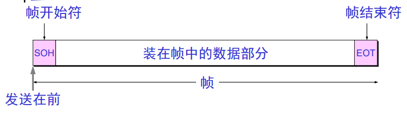
2. 透明传输 
   * 透明 *转化数据部分中的标志符,使其存在却又不影响功能*
   * 解决方法 ***字节填充或字符填充***
3. 差错检测
   * 误码率 BER (Bit Error Rate)
   * 检错方法
     * 奇偶检错
        * 仅可检测错奇数位错误 捡漏率50%
     * 循环冗余检错 CRC *Cyclic Redundancy Check*
       * 除数P 由生成多项式确定
       * 冗余码 ***FCS*** 源码除除数余数即为冗余码
       * 传送的帧=源码+冗余码
       * 结果判断
         * 接受端用除数除以帧 得出余数若为0即无差错

### 点对点协议 PPP

 ***Point-to-Point Protocol***

1. 帧组成
   * 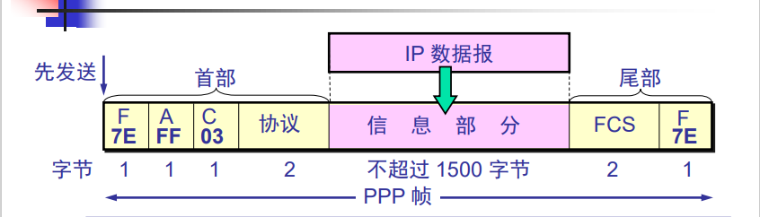
   * PPP帧开始符与帧结束符相同 ***F 0x7E***
   * 协议字段 
      1. IP协议
      2. 链路控制协议 LCP *Link Control Protocol*
      3. 网络控制协议 NCP *Network Control Protocol*

2. PPP帧 透明传输
  * 字节填充
    * (0x7E) -> (0x7D,0x5E) *转义符0x7D*
    * (0x7D) -> (0x7D,0x5D) *转义符再转义*
    * 若数值小于0x20 则要在前加入0x7D 同时改变该字符编码 ***如 (0x03) -> (0x7D,0x23)***
  * 零比特填充
    * 若出现连续5个1,就立即填入一个0

3. 工作状态
  * 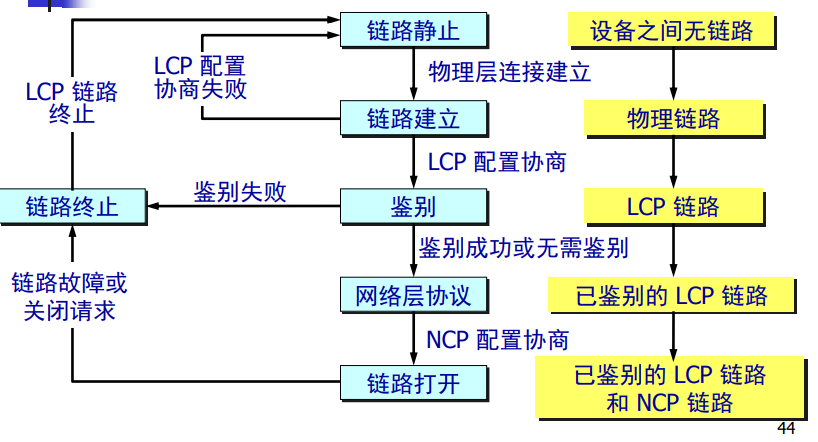

### 共享信道的方法
* 静态划分信道 *通过复用技术，代价较高，不适合局域网*
* 动态媒体接入控制 *多点接入，信道并非在用户通信时固定分配给用户*
  * 随机接入 *所有用户可随机的发送信息，但容易发生碰撞*
  * 受控接入 *轮询，局域网中运用较少*

### 载波监听多点接入/碰撞协议 CSMA/CD

 ***Carrier Sense Multiple Access with Collision Detection***

* 多点接入 *可以说明该协议运用在总线型无连接网络上*
* 最短帧长 64字节
  * 防止因帧长太短而检测不到碰撞
* 工作原理
  * 发前先监听,空闲即发送
  * 边发边检测,冲突时退避
* 二进制指数退避算法
  * 发生碰撞后需要隔一段时间再次发送信息
  * 当重传次数达16次仍失败后，丢弃该帧
  * 最大退避时间T*1023
  * 争用期51.2us <-> 10Mbit/s
* 最短帧长 = 往返时延 * 速率

### 以太网
* 布线介质标志 10BaseT
  * 10 *数据率 Mbps*
  * Base 或Broad *基带或宽带*
  * T F X 或数字 *介质类型或最大长度*

* 以太网信道利用率

* ***以太网 MAC 层***
  * MAC地址 或硬件地址 *48位*

* 以太网交换机自学习原理
  * 记录每次数据来源的接口与mac地址
  * 存在问题 **回路**
    * 生成树协议消除回路

* 以太网帧格式 (802.1Q)
  * 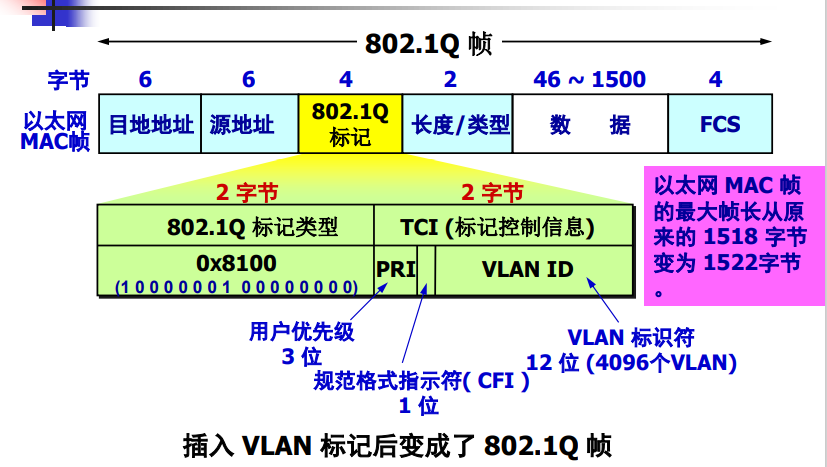

-----------

## 网络层

### 基本服务方式
* 数据报 *无连接*
* 虚电路 *面向连接*

### 网际协议 IP协议 

***Internet Protocol***

* 提供不可靠，无连接的服务
* 配套使用的协议
  * 地址解析协议 ARP *Address Resolution Protocol*
  * 网际控制报文协议 ICMP *Internet Control Messafe Protocol*
  * 网际组管理协议 IGMP *Internet Group Management Protocol*
* IP地址 
  * IPV4 32位
  * 分类编址
    * 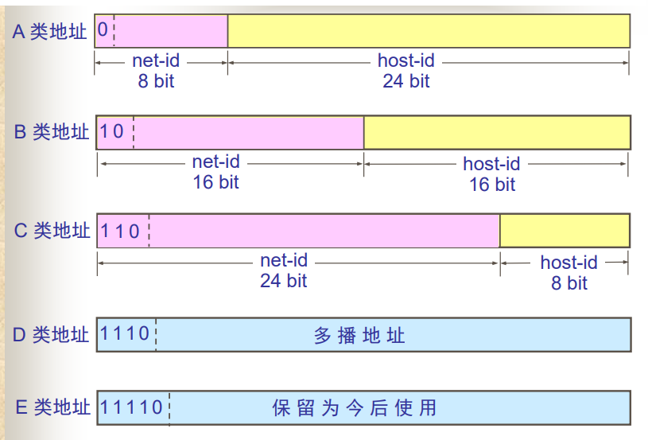
  * 无分类编址CIDR *Classless Inter-Domain Routing*
    * IP地址={<网络前缀>,<主机号>}
    * 斜线记法 如128.14.35.7/20 以此来区分前缀与主机号
* IP数据报格式
  * 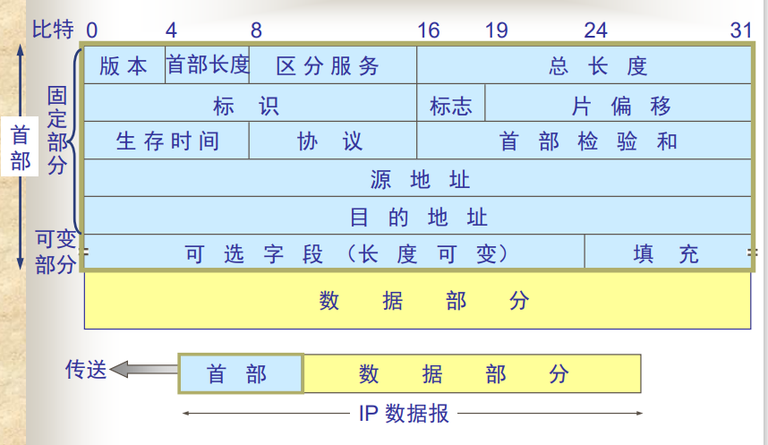
  * IP数据分片
    * 片偏移记录当前载数据所在总数据段中的位置 单位:8个字节

* 分组转发
  * 路由器分组转发算法
    1. 从数据报中获取目的主机IP 得到目的网络IP
    2. 若该网络与路由器直接相连，则直接交付给目的主机
    3. 若路由表中有特定主机路由指向目的网络，则将目的IP指向该特定路由器
    4. 若路由表中有到达目的网络的路由，则把目的IP指向该路由器
    5. 若没有有效信息，则转发至默认路由
    6. 报告转发分组出错

### ARP 
* 解决同一局域网上主机或路由器的IP地址和Mac地址的映射问题
* ARP 高速缓存

### 网际控制报文协议 ICMP 
* 种类
  * 差错报告报文
  * 询问报文
* 报文格式
  * 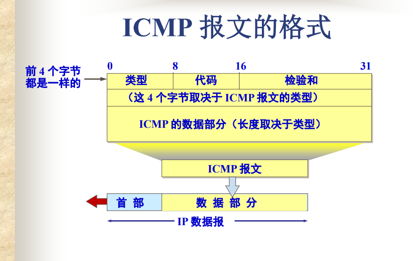
* 实际运用
  * ping
  * traceroute *寻径命令*

### 路由选择协议
* 种类
  * 静态协议 *人工配置路由*
  * 动态协议
  * 域间路由选择
    * 内部网关协议 IGP *Interior Gateway Protocol*
      * 距离向量协议 RIP *Routing Information Protocol*
        * 简单，适用于小型互联网
      * 最短路径优先协议 OSPF *Open Shortest Path First*
        * 复杂，适用大型互联网
  * 域内路由选择
    * 外部网关协议 EGP *External Gateway Protocol*

### IPv6
* 改进特征
  * 32位 -> 128位
  * 扩展的地址层次结构
  * 灵活的首部格式
  * 改进的选项
  * 允许协议继续扩充
  * 支持即插即用
  * 支持资源预分配
  * 首部改为8字节对齐
* 表示方法
  * 冒号十六进制记法
  * 零压缩法
* IPv4 过渡到 IPv6 的策略
  * 隧道技术
  * 双栈协议
  * 协议翻译技术 .NET

---------

## 运输层

* 网络层为主机提供服务，运输层为应用进程提供服务
  
### 端口号
* 意义
  * 标志应用层的进程
* 类型
  * 服务器端使用的端口号
    * 熟知端口号 *0~1023*
    * 登记端口号 *1024~49151*
  * 客户端使用的端口号
    * 又称短暂端口号 *49152~65535*
    * 当进程通信结束后这个端口号回动态的供其他进程使用

- 常见端口号
  - HTTP:80 端口
  - HTTPS:443 端口
  - FTP:21 端口
  - SMTP:25 端口
  - DNS:53 端口
  - WebSocket:8080 端口
  - SSL/TLS:443 端口
  - SSH:22 端口
  - Telnet:23 端口
  - ICMP:123 端口

### 用户数据报协议 UDP 

***User Datagram Protocol***

* 特点
  * 无连接
  * 不保证可靠交付
  * 面向报文
  * 没有拥塞控制
  * 支持多种通信方式
  * 首部开销少 *只有8字节*
* 报文格式
  * 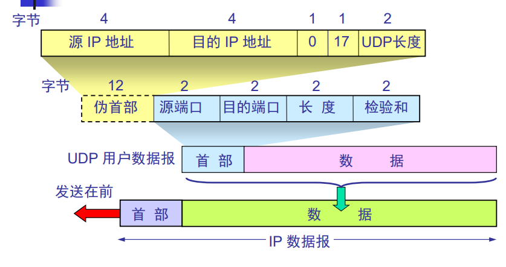
  * 伪首部 *由图中信息自动拼接而来 仅仅为了计算检验和*
  * 检验和 *用检验和的方法检错*

### 传输控制协议 TCP

**TCP *Transmission Control Protocol***

* 特点
  * 面向连接
  * 仅支持点对点的通信
  * 提供可靠交付
  * 全双工通信
  * 面向字节流
* 连接
  * 通过套接字对确定连接
* 报文格式
  * 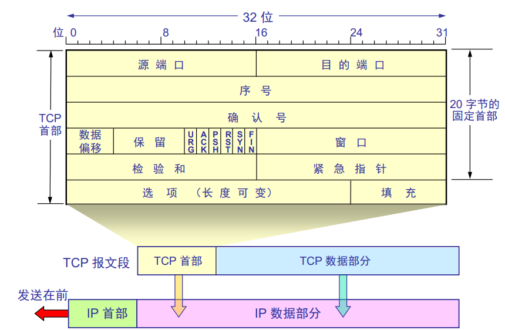
  * 序号 seq *本报文段所发送数据的第一个字节序号*
  * 确认号 ack *期望下一个报文发送的序号*
  * flag 
    * URG 紧急指针标志位
    * **ACK 确认信息标志位**
    * PSH 推送操作标志位
    * RST 重置连接标志位
    * **SYN 同步序号标志位**
    * **FIN 终止连接标志位**
  * 窗口 cwnds *表示发送窗口大小*
  * 紧急指针 *指出本报文中紧急数据数量*
* 可靠传输
  * 原理
    * 停等协议 
    * 自动重传请求 ARQ *Automatic Repeat reQuest*
    * 流水线传输
    * 累计确认 
      * *当某个分组确认到达后，接收方默认当前确认前的分组都已到达*
    * Go-back-N 
      *  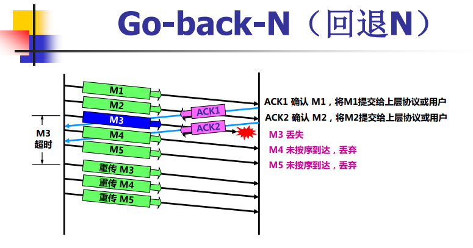
   *  选择重传
      *  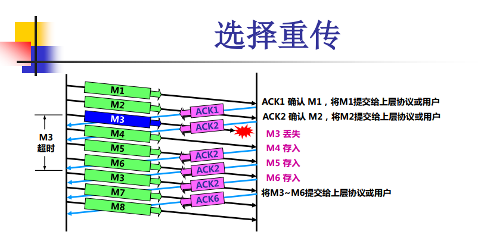
  *  实例
     *  滑动窗口
* 流量控制
  * 让发送发的发送速率不要太快，要让接收方来得及接受
  * 方法 *控制窗口大小来控制发送速率*
* 拥塞控制
  * 防止过多数据涌入网络中，导致路由器或链路过载
  * 算法
    * 慢开始
    * 拥塞避免
    * 快恢复
    * 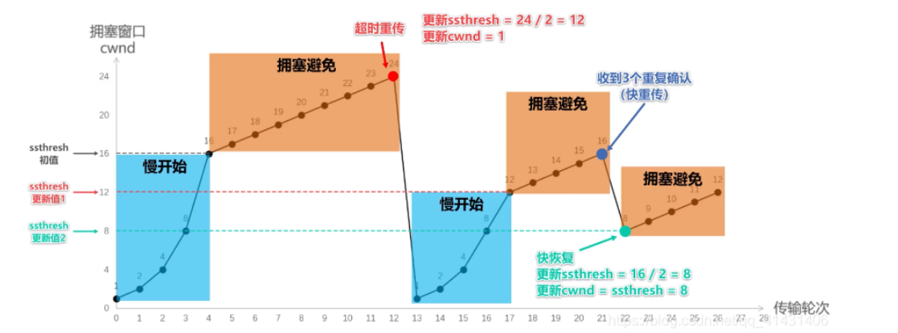
    * 快重传
    * 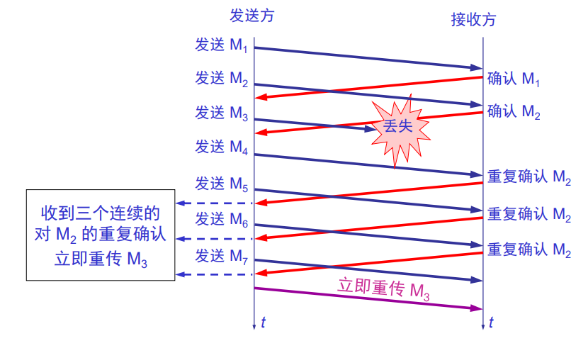
* ***三次握手***
  * 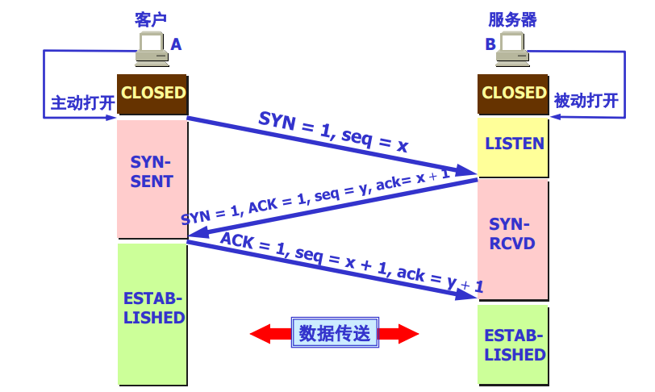
  1. 客户机请求连接
  2. 服务器确认连接
  3. 客户机确认建立连接
  
* ***四次挥手***
  * 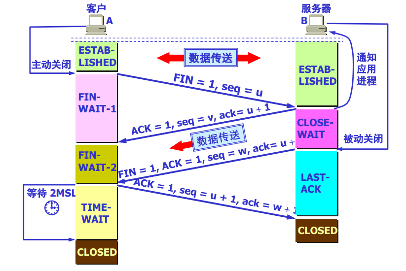
  1. 客户机请求断开连接
  2. 服务器确认收到请求，并向应用通知
  3. 应用确认关闭，向客户机确认断开连接，并停止数据传送
  4. 客户机确认断开连接

-----------------

##  应用层

###  域名系统 *DNS*
  * 互联网使用的命名系统，用来便于人们使用的机器名字转换为IP地址
  * 域名结构 ***树状结构***
    * 如 mail.edu.cn ***越往后层级越高***
    * 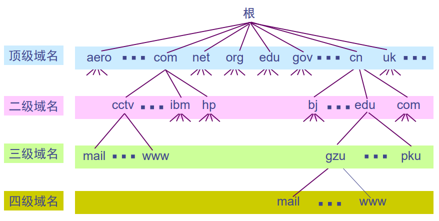
  * 域名服务器
    * 用于解析域名的IP地址
    * 分类
      * 根域名服务器
      * 顶级域名服务器
      * 权限域名服务器
      * 本地域名服务器
    * 域名解析过程
      * 迭代查询
        * 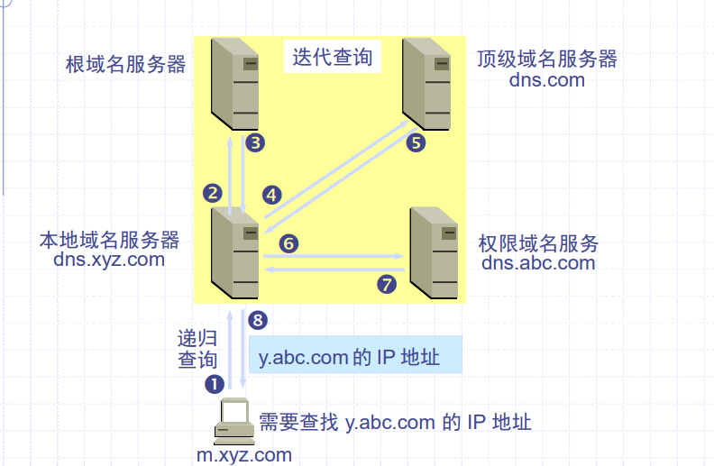
      * 递归查询
        * 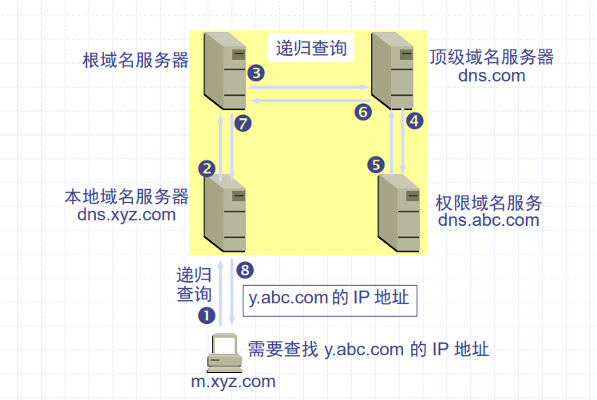

###  万维网 *WWW*

***World Wide Web***

  * 通过链接的方法使因特网上的一个站点访问另一个站点，从而主动地按需获取丰富信息

  * 统一资源定位符 ***URL Uniform Resource Locator***
    * 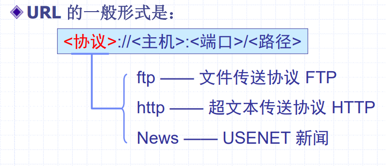
    
#### 超文本传送协议 HTTP 

*HyperText Transfer Protocol* 

实现超链的链接

##### 特点 

* 使用了TCP做了运输协议
* 是一种面向事物的可恶服务器协议
* HTTP 本身是无连接的
* HTTP 1.0 是无状态的（不安全的）

##### 类型

* 请求报文
  * 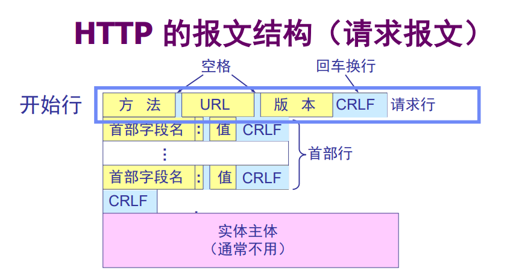
* 响应报文
  * 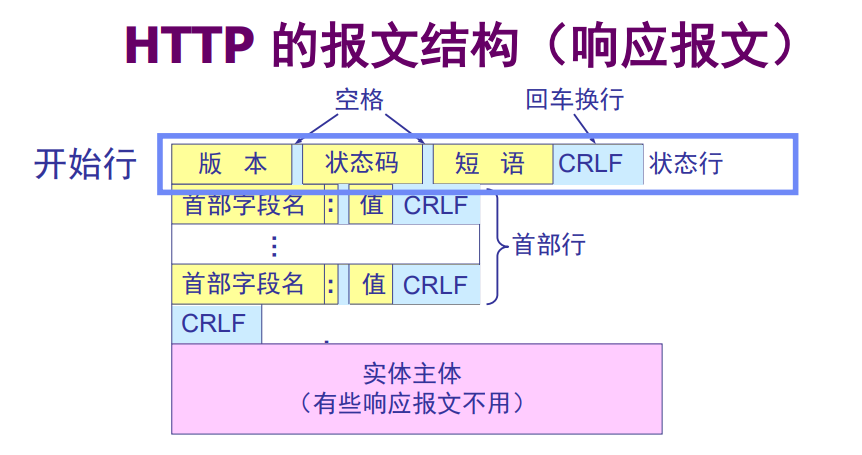

##### 状态码

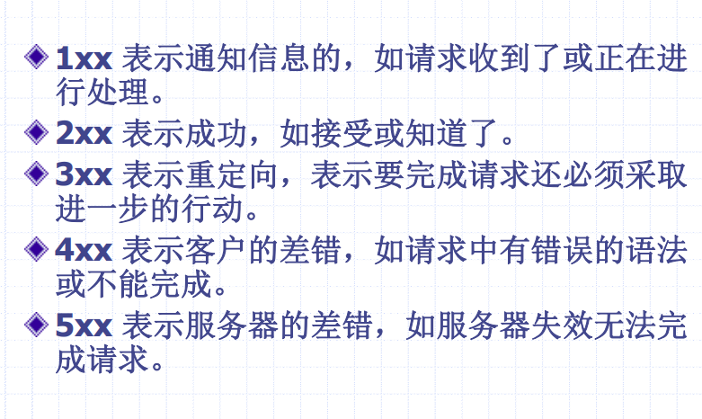
1. 100 Continue - 表示请求已收到，继续发送请求的其他部分。
2. 101 Switching Protocols - 表示请求已接受，正在转换为新的协议。
3. 200 OK - 表示请求已成功。
4. 201 Created - 表示请求的资源已被创建。
5. 202 Accepted - 表示请求已被接受，但服务器尚未处理。
6. 203 Non-Authoritative Information - 表示请求的资源已被返回，但并非来自服务器的官方资源。
7. 204 No Content - 表示请求的资源已被删除。
8. 205 Reset Content - 表示请求的资源已被重置。
9. 206 Partial Content - 表示请求的资源已被部分返回。
10. 300 Multiple Choices - 表示请求的资源有多个选择。
11. 301 Moved Permanently - 表示请求的资源已被永久移动到新位置。
12. 302 Found - 表示请求的资源已被重定向到新位置。
13. 303 See Other - 表示请求的资源已被另一种资源响应。
14. 304 Not Modified - 表示请求的资源未被修改，因此无需重新发送请求。
15. 305 Use Proxy - 表示请求的资源需要通过代理服务器访问。
16. 306 Redirected - 表示请求的资源已被重定向到新位置。
17. 307 Temporary Redirect - 表示请求的资源已被临时重定向到新位置。
18. 400 Bad Request - 表示请求存在语法错误或其他错误，服务器无法正确理解请求。
19. 401 Unauthorized - 表示请求未经授权，需要输入用户名和密码以获取访问权限。
20. 402 Payment Required - 表示请求需要支付一定的费用才能访问。
21. 403 Forbidden - 表示请求的资源已被禁止访问。
22. 404 Not Found - 表示请求的资源不存在或未被服务器找到。
23. 405 Method Not Allowed - 表示请求的方法不被服务器允许。
24. 406 Not Acceptable - 表示请求的资源不符合服务器的接受范围。
25. 407 Proxy Authentication Required - 表示请求需要通过代理服务器进行身份验证。
26. 408 Request Timeout - 表示请求的超时时间已到，服务器未收到请求的响应。
27. 409 Conflict - 表示请求的资源已被修改，服务器拒绝接受请求。
28. 410 Gone - 表示请求的资源已被删除，服务器拒绝接受请求。
29. 411 Length Required - 表示请求的资源需要指定长度。
30. 412 Precondition Failed - 表示请求的资源存在前置条件，该条件未满足。
31. 413 Request Entity Too Large - 表示请求的资源太大，服务器无法处理。
32. 414 Request-URI Too Long - 表示请求的 URI 太长，服务器无法处理。
33. 415 Unsupported Media Type - 表示请求的资源不支持指定的媒体类型。
34. 416 Overflow - 表示服务器的缓存已满，无法处理请求。
35. 417 Expectation Failed - 表示请求的期望条件未满足，服务器拒绝接受请求。
36. 500 Internal Server Error - 表示服务器内部出现了错误，无法完成请求。

#### 超文本标记语言 *HTML*

*HyperText Markup Language*

* 标记文档中的超链接

#### 搜索引擎 

***方便用户找到所需的信息***

* 全文检索引擎
  * Google 百度
* 分类目录搜索引擎
  * 雅虎 新浪 网易

###  电子邮件 
  * 用户代理 UA *User Agent 在客户机上与邮件服务器交流的应用*
    * 基本功能
      * 撰写 显示 处理 通信
  * 发送邮件协议 ***SMTP Simple Mail Transfer Protocol***
  * 接收邮件协议
    * 邮局协议 *POP3 Post Office Protocol*
      * 如同现实中将邮件存放在邮局内一样，邮件被用户代理接收后，即在服务器中删除该邮件
    * 网际报文存储协议 *IMAP Internet Message Access Protocol*
      * 将邮件信息存储到邮件服务器上，用户代理可对其进行操作，相当于一个联机协议
  * 通用互联网邮件扩充协议 *MIME*
    * 扩展了SMTP的编码规则，使其可以传送更多格式的文件
###  文件传送协议 *FTP*
###  远程登录 *Telnet*
###  动态主机配置协议 *DHCP*

*即插即用联网*

## 安全保证

### 加密算法

#### 对称加密

又称私人密钥加密/共享密钥加密

**加密与解密使用同一密钥**

特点 加密强度不高单效率高，密钥分发困难

- DES *数据加密标准*
- 3DES
- AES *高级加密标准*
- RC4

#### 非对称加密

又称为公开密钥加密

**密钥必须成对使用 即公钥与密钥**

特点 加密速度慢单强度高

- RSA 它是公认的最早和最广泛使用的公钥密码算法之一，被广泛用于保护数据的机密性和完整性
- DSA *数字签名算法*
- ECC *椭圆曲线密码算法*

#### 散列函数加密

又称哈希加密 是一种单向加密算法

主要用于验证数据完整性和实现消息认证，如数字签名和数据验证等

值得注意的是 该算法无法还原原始明文，因此不能用于保护数据的机密性。

- MD5 *消息摘要算法* **128位**
- SHA-1 *安全哈希算法1* **160位**

### 数字签名

数字签名是一种用于确保数据完整性、身份验证和防止抵赖的技术，通过将数据的哈希值使用私钥进行加密得到数字签名，并将数字签名和数据一起发送给接收方，接收方可以使用公钥进行解密得到哈希值，然后对收到的数据使用相同的哈希函数计算哈希值，比较两个哈希值是否相同，来验证数据完整性和真实性。

数字签名可以用于保护消息、文件或代码的完整性，防止篡改或伪造，并且可以证明消息的来源和时间戳。

### 数字证书

数字证书则是用于验证身份和建立信任关系的一种技术，它是由可信的第三方机构（如数字证书颁发机构，CA）签发的电子文件，用于验证某个实体（例如个人、公司或网站）的身份和授权信息。数字证书通常包含持有者的公钥、证书序列号、数字签名和证书颁发机构的信息等。

当一个网站或服务使用数字证书进行加密通信时，客户端可以使用数字证书来验证该网站或服务的身份和授权信息，并建立加密通道来保护通信的安全性。
