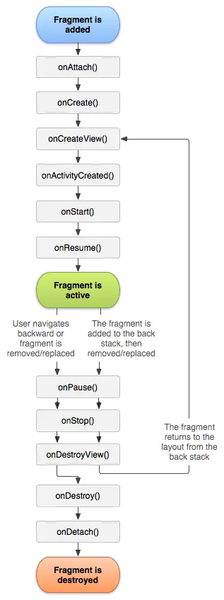
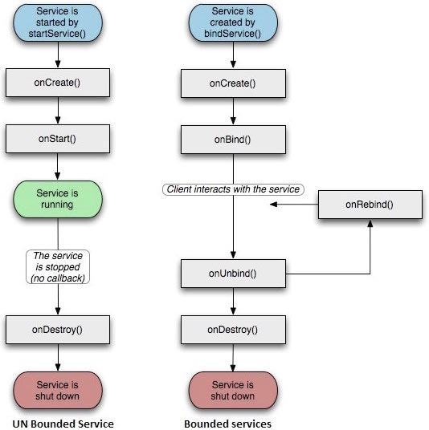

## 组件

### Activity

#### 生命周期

在Android开发中，`Activity` 是用户与应用交互的界面，每个`Activity` 都拥有自己的生命周期，这些生命周期状态反映了`Activity`在屏幕上的不同表现。以下是`Activity`的主要生命周期状态：
1. **onCreate(Bundle savedInstanceState)**：
   - 当`Activity`第一次创建时调用。
   - 用于初始化界面和数据。
2. **onStart()**：
   - 当`Activity`从停止状态变为可见状态时调用。
   - 表示`Activity`现在可见，但还没有获得焦点。
3. **onResume()**：
   - 当`Activity`准备好与用户交互时调用。
   - 这是`Activity`生命周期中最重要的方法之一，因为它标志着`Activity`处于活动状态。
4. **onPause()**：
   - 当`Activity`失去焦点，即将被暂停时调用。
   - 用于保存临时状态，如用户输入的数据。
5. **onStop()**：
   - 当`Activity`不再可见时调用。
   - 用于释放资源，如停止动画和停止监听网络。
6. **onDestroy()**：
   - 当`Activity`即将被销毁时调用。
   - 用于清理资源，如注销广播接收器和停止服务。
7. **onRestart()**：
   - 当`Activity`从停止状态变为启动状态时调用。
   - 通常在`onStop()`和`onStart()`之间调用。


了解这些生命周期方法对于管理资源、处理用户输入和确保应用程序的稳定性至关重要。开发者需要根据`Activity`的生命周期来合理安排代码，以确保应用程序在不同状态下都能正常工作。


#### 父子 Activity的信息传递


### Fragment

#### 生命周期

`Fragment` 的生命周期与 `Activity` 的生命周期紧密相关，但也有一些特有的方法来处理 `Fragment` 特有的情况。以下是 `Fragment` 的主要生命周期方法：

1. **onCreate(@Nullable Bundle savedInstanceState)**：
   - 在 `Fragment` 被创建时调用。
   - 用于初始化 `Fragment` 的数据。
   - 可以在这里恢复保存的状态。

2. **onCreateView(@NonNull LayoutInflater inflater, @Nullable ViewGroup container, @Nullable Bundle savedInstanceState)**：
   - 当 `Fragment` 的视图需要被创建时调用。
   - 通过 `LayoutInflater` 加载 `Fragment` 的布局文件。
   - 返回 `Fragment` 的根视图。

3. **onViewCreated(@NonNull View view, @Nullable Bundle savedInstanceState)**：
   - 在 `Fragment` 的视图创建并添加到 `Fragment` 后调用。
   - 用于初始化视图组件。

4. **onActivityCreated(@Nullable Bundle savedInstanceState)**：
   - 在宿主 `Activity` 的 `onCreate` 方法调用后调用。
   - 用于进行依赖于 `Activity` 已创建的操作。

5. **onViewStateRestored(@Nullable Bundle savedInstanceState)**：
   - 在视图状态恢复后调用。
   - 用于恢复视图的状态。

6. **onStart()**：
   - 当 `Fragment` 变得可见时调用。

7. **onResume()**：
   - 当 `Fragment` 准备与用户交互时调用。
   - 这是处理用户输入的好时机。

8. **onPause()**：
   - 当 `Fragment` 不再与用户交互时调用。
   - 用于保存临时状态或停止动画。

9. **onStop()**：
   - 当 `Fragment` 不再可见时调用。

10. **onDestroyView()**：
    - 当 `Fragment` 的视图被销毁时调用。
    - 用于清理视图资源。

11. **onDestroy()**：
    - 当 `Fragment` 被销毁时调用。
    - 用于释放资源。

12. **onDetach()**：
    - 当 `Fragment` 从 `Activity` 分离时调用。
    - 用于清理与 `Activity` 相关的资源。



### 广播接收器（Broadcast Receiver）

在Android系统中，广播（Broadcast）是一种低开销的消息传递机制，用于在应用组件之间或系统与应用之间传递信息。广播可以被用来响应各种系统事件或应用内部事件。

#### 广播的类型

1. **普通广播（Normal Broadcast）**：
   - 任何组件都可以发送和接收。
   - 接收者可以是Activity、Service或BroadcastReceiver。
   - 可以被应用内的多个接收者接收。

2. **有序广播（Ordered Broadcast）**：
   - 按照优先级顺序传递给多个接收者。
   - 每个接收者都可以对广播内容进行修改，并且决定是否继续传递给下一个接收者。
   - 通常用于需要多个组件依次处理的情况。

3. **粘性广播（Sticky Broadcast）**：
   - 一旦发送出去，就会“粘”在广播管理器上，直到相应的BroadcastReceiver组件被注册。
   - 用于传递持续有效的广播，如耳机的插拔状态。

#### 发送广播

发送广播可以使用`Context`类中的`sendBroadcast()`、`sendOrderedBroadcast()`或`registerReceiver()`方法。

- **发送普通广播**：
  ```java
  Intent intent = new Intent("com.example.MY_ACTION");
  sendBroadcast(intent);
  ```

- **发送有序广播**：
  ```java
  Intent intent = new Intent("com.example.MY_ACTION");
  sendOrderedBroadcast(intent, null);
  ```

- **发送粘性广播**：
  ```java
  Intent intent = new Intent("com.example.MY_ACTION");
  sendStickyBroadcast(intent);
  ```

#### 接收广播

接收广播需要在AndroidManifest.xml中注册`<receiver>`标签，或者在代码中动态注册。

- **在AndroidManifest.xml中注册**：
  ```xml
  <receiver android:name=".MyBroadcastReceiver">
      <intent-filter>
          <action android:name="com.example.MY_ACTION" />
      </intent-filter>
  </receiver>
  ```

- **动态注册**：
  ```java
  BroadcastReceiver receiver = new BroadcastReceiver() {
      @Override
      public void onReceive(Context context, Intent intent) {
          // 处理接收到的广播
      }
  };
  IntentFilter filter = new IntentFilter("com.example.MY_ACTION");
  registerReceiver(receiver, filter);
  ```

#### 广播的权限

广播可以设置权限，以限制哪些应用可以发送或接收特定的广播。

- **发送权限受限的广播**：
  ```java
  Intent intent = new Intent("com.example.MY_ACTION");
  sendBroadcast(intent, "com.example.MY_PERMISSION");
  ```

- **接收权限受限的广播**：
  ```xml
  <receiver android:name=".MyBroadcastReceiver">
      <intent-filter>
          <action android:name="com.example.MY_ACTION" />
      </intent-filter>
      <uses-permission android:name="com.example.MY_PERMISSION" />
  </receiver>
  ```

#### 注意事项

1. **不要在广播中执行耗时操作**：广播接收者是在主线程中执行的，执行耗时操作会导致应用无响应。
2. **使用局部广播（Local Broadcast）**：从Android 3.1开始，可以使用局部广播，它不会离开应用的上下文，更安全且高效。
3. **清理动态注册的接收者**：如果使用动态注册，确保在适当的生命周期（如`onPause()`）中调用`unregisterReceiver()`来避免内存泄漏。

广播是一种有效的消息通信机制，但使用时需要注意其对性能和安全性的影响。


### 服务（Service）

在Android中，`Service` 是一种没有用户界面的组件，它在后台执行长时间运行的操作，即使用户切换到其他应用或屏幕关闭时，它也可以继续运行。`Service` 有三种主要类型：

1. **前台服务（Foreground Service）**
2. **后台服务（Background Service）**
3. **绑定服务（Bound Service）**

前台服务通常用于执行重要的后台任务，如播放音乐或下载文件，并且用户可以通过系统状态栏看到这些服务。后台服务则用于执行不需要用户立即知晓的任务。

需要注意的是，从Android 8.0（API级别26）开始，后台服务的使用受到了更多限制，以优化设备的电池使用。因此，对于长时间运行的后台任务，建议使用 `WorkManager` 或 `JobScheduler` 等其他机制。

使用服务时，需要在AndroidManifest.xml文件中声明Service，并通过Intent-filter来启动Service。
示例代码：

   ```xml
   <service android:name=".MyService"/>
   ```

#### 生命周期
每种类型的 `Service` 都有其特定的生命周期和管理方式。以下是 `Service` 的生命周期方法：

1. **onCreate()**：
   - 当 `Service` 首次创建时调用。
   - 用于执行一次性的设置工作，如初始化资源。

2. **onStartCommand(Intent intent, int flags, int startId)**：
   - 当 `Service` 通过 `startService()` 方法被启动时调用。
   - 用于处理服务启动时的命令。

3. **onBind(Intent intent)**：
   - 当客户端通过 `bindService()` 方法绑定到 `Service` 时调用。
   - 返回一个 `IBinder` 对象，客户端可以通过它与 `Service` 进行交互。

4. **onUnbind(Intent intent)**：
   - 当所有客户端都解绑时调用。
   - 用于执行解绑时的清理工作。

5. **onDestroy()**：
   - 当 `Service` 即将被销毁时调用。
   - 用于执行必要的清理工作，如释放资源。

6.  **onDestroy()**：
    - 当 `Service` 即将被销毁时调用。
    - 用于执行必要的清理工作。



#### 启动服务
这是最常用的启动Service的方法。当你调用`startService`时，系统会创建一个Service实例，调用它的`onCreate`和`onStartCommand`方法，并执行你的后台任务。
示例代码：
 ```java
 Intent serviceIntent = new Intent(this, MyService.class);
 startService(serviceIntent);
 ```

也可以使用`Intent`在Manifest中声明
```xml
<service android:name=".MyService">
    <intent-filter>
        <action android:name="com.example.MY_ACTION" />
    </intent-filter>
</service>
```

然后在代码中发送一个Intent来启动Service：
```java
Intent intent = new Intent("com.example.MY_ACTION");
startService(intent);
```

#### 绑定服务
这种方法允许组件与Service进行交互，通常用于需要频繁通信的场景。
通过绑定Service，你可以调用Service中的方法。
绑定服务通常需要在 onStart 或 onResume 方法中进行，解绑则在 onStop 或 onPause 方法中进行。
示例代码：
```java
private ServiceConnection serviceConnection = new ServiceConnection() {
      @Override
      public void onServiceConnected(ComponentName className, IBinder service) {
         // 我们已经绑定到LocalService，强制转换IBinder并获取LocalService实例
         MyService.LocalBinder binder = (MyService.LocalBinder) service;
         myService = binder.getService();

         // 现在可以调用服务的方法
      }

      @Override
      public void onServiceDisconnected(ComponentName arg0) {
      }
   };

Intent intent = new Intent(this, MyService.class);
bindService(intent, serviceConnection, Context.BIND_AUTO_CREATE);

```
其中`serviceConnection`是一个实现了`ServiceConnection`接口的对象。

### 适配器（Adapter）
在Android开发中，适配器（Adapter）是一个将数据集合映射到视图集合的类，通常用于将数据源（如数组、列表或数据库查询结果）转换为可以在视图组件（如ListView、GridView、RecyclerView等）中显示的视图项。适配器充当数据源和视图之间的桥梁。

常见的适配器类型：
1. ArrayAdapter：适用于将数组或列表转换为视图。
2. CursorAdapter：适用于从数据库查询结果（Cursor）转换为视图。
3. SimpleAdapter：适用于将键值对映射到视图的不同属性。
4. BaseAdapter：一个抽象类，提供了适配器的基本实现，可以自定义适配器。
5. RecyclerView.Adapter：用于RecyclerView控件，功能更强大和灵活。
以下是baseAdapter的使用方法。
```java
public class MyCustomAdapter extends BaseAdapter {
    private Context context;
    private List<String> data;
    public MyCustomAdapter(Context context, List<String> data) {
        this.context = context;
        this.data = data;
    }
    @Override
    public int getCount() {
        return data.size();
    }
    @Override
    public Object getItem(int position) {
        return data.get(position);
    }
    @Override
    public long getItemId(int position) {
        return position;
    }
    @Override
    public View getView(int position, View convertView, ViewGroup parent) {
        if (convertView == null) {
            convertView = LayoutInflater.from(context).inflate(R.layout.my_list_item, null);
        }
        TextView textView = convertView.findViewById(R.id.text_view);
        textView.setText(data.get(position));
        return convertView;
    }
}
```

```java
// 在Activity中使用自定义适配器
ListView listView = findViewById(R.id.listview);
List<String> data = new ArrayList<>(); // 填充数据
MyCustomAdapter adapter = new MyCustomAdapter(this, data);
listView.setAdapter(adapter);

```

### 意图（Intent）

在Android开发中，Intent是组件之间通信的桥梁，它用于请求另一个组件执行操作。Intent可以用于启动活动（Activity）、服务（Service）、广播接收器（BroadcastReceiver）等。
在AndroidManifest.xml中，可以通过`<intent-filter>`标签为Activity、Service和BroadcastReceiver声明可以接受的Intent类型。

以下是Intent的一些基本概念和用法：

#### Intent的类型
1. **显式Intent**：
   - 直接指定目标组件的类名。
   - 用于明确调用特定应用的特定组件。
   - 示例代码：
```java
Intent intent = new Intent(MainActivity.this, SecondActivity.class);
startActivity(intent);
```
2. **隐式Intent**：
   - 不指定目标组件，而是通过Action和数据（Data）来描述要执行的操作。
   - 系统会根据Action和Data找到合适的组件来处理Intent。
   - 示例代码：
```java
Intent intent = new Intent(Intent.ACTION_VIEW, Uri.parse("http://www.example.com"));
startActivity(intent);
```

#### Intent的组成
1. **Action**： 描述要执行的操作，如`Intent.ACTION_VIEW`、`Intent.ACTION_EDIT`等。
2. **Data**： 指定要操作的数据，如URI、URL等。
3. **Category**： 为Intent添加额外的上下文信息，如`Intent.CATEGORY_LAUNCHER`表示启动一个活动。
1. **Extras**：附加信息，以键值对的形式存在，用于在组件之间传递数据。

### 数据绑定（Data Binding）

在Android开发中，数据绑定（Data Binding）是一种在Activity或Fragment中将布局中的视图（View）与数据源（如Activity或ViewModel中的数据）相绑定的技术。数据绑定的好处是减少了模板代码的数量，提高了代码的可维护性和可读性，并且使得UI的更新更加方便。

### 数据绑定的基本步骤：

1. **启用数据绑定**：
   - 在模块级别的`build.gradle`文件中启用数据绑定。
     ```groovy
     android {
         ...
         dataBinding {
             enabled = true
         }
     }
     ```

2. **定义布局文件**：在布局文件中添加`<layout>`标签作为根元素，并为可绑定的视图指定`android:bind`属性。

3. **创建绑定类**：数据绑定框架会自动生成一个绑定类，通常以`Binding`结尾。

1. **在Activity或Fragment中使用**： 在`onCreate()`或`onCreateView()`中初始化绑定对象，并使用它来访问视图和数据。

### 示例：

**布局文件（activity_main.xml）**：
```xml
<layout xmlns:android="http://schemas.android.com/apk/res/android">
    <data>
        <variable
            name="user"
            type="com.example.User"/>
    </data>
    <LinearLayout
        android:layout_width="match_parent"
        android:layout_height="match_parent"
        android:orientation="vertical">
        <TextView
            android:layout_width="wrap_content"
            android:layout_height="wrap_content"
            android:text="@{user.name}"
            android:onClick="@{view -> handler.onClick(view)}"/>
        <!-- 其他视图 -->
    </LinearLayout>
</layout>
```

**Activity（MainActivity.java）**：
```java
public class MainActivity extends AppCompatActivity {
    @Override
    protected void onCreate(Bundle savedInstanceState) {
        super.onCreate(savedInstanceState);
        MainActivityBinding binding = DataBindingUtil.setContentView(this, R.layout.activity_main);
        User user = new User("Kimi", 30);
        binding.setUser(user);
        binding.setLifecycleOwner(this);
    }
}
```

### 数据绑定的关键概念：

1. **变量绑定**： 使用`<variable>`标签在布局文件中定义变量，并在Activity或ViewModel中赋值。
1. **表达式**： 在XML中使用表达式语言来绑定数据，例如`android:text="@{user.name}"`。
2. **绑定类**：数据绑定框架生成的绑定类提供了对布局中视图的访问和对数据的绑定。
1. **生命周期管理**：使用`setLifecycleOwner()`将绑定对象与Activity或Fragment的生命周期关联起来。
1. **事件绑定**： 可以直接在XML中绑定事件监听器，例如`android:onClick="@{view -> handler.onClick(view)}"`。
2. **双向绑定**： 数据绑定支持双向绑定，可以自动更新UI和数据源。


### 处理者 handler

在Android开发中，`Handler` 是一个非常核心的组件，它用于处理线程间的通信。`Handler` 允许你发送和处理 `Message` 或 `Runnable` 对象与它关联的线程的 `MessageQueue` 中。以下是 `Handler` 的一些关键点：
1. **线程安全**：`Handler` 是线程安全的，它确保了 `MessageQueue` 的操作是原子的。
2. **消息循环**：`Handler` 通过消息循环（Message Loop）来处理消息。消息循环是一个不断从 `MessageQueue` 中取出消息并分发给 `Handler` 处理的循环。
3. **消息（Message）**：`Message` 是 `Handler` 处理的实体，它包含一个 what（整数标识符）、arg1 和 arg2（两个整数参数）、一个 `Bundle`（携带数据）、target（目标 `Handler`）和 callback（回调接口）。
4. **Runnable**：除了 `Message`，`Handler` 也可以处理 `Runnable` 对象。`Runnable` 会在 `Handler` 所在的线程中执行。
5. **Looper**：`Looper` 是一个不断循环的线程，它持有一个 `MessageQueue`，并且不断地从队列中取出消息并分发给 `Handler` 处理。每个线程可以有一个 `Looper`，但通常一个线程只有一个。
6. **主线程（UI线程）**：在Android应用中，主线程（UI线程）默认有一个 `Looper`，因此可以直接创建 `Handler` 实例而不需要显式地为其指定 `Looper`。
7. **子线程**：在子线程中使用 `Handler` 时，需要先为该线程设置一个 `Looper`。
8. **延时消息**：`Handler` 可以发送延时消息，即在指定的时间后将消息放入消息队列。
9. **同步屏障**：`Handler` 可以发送同步屏障消息，这可以确保所有的消息都处理完毕后再执行该消息。
10. **内存泄漏**：如果 `Handler` 持有外部类的强引用，可能会导致内存泄漏，因为 `MessageQueue` 会持有消息，而消息又持有 `Handler` 的引用。
11. **HandlerThread**：`HandlerThread` 是一个方便的类，它创建了一个新线程，并在这个线程中设置了 `Looper`。你可以在这个线程中创建 `Handler` 来处理后台任务。
12. **消息处理**：`Handler` 通过 `handleMessage(Message msg)` 方法来处理消息。

下面是一个简单的 `Handler` 使用示例：

```java
new Handler(Looper.getMainLooper()) {
    @Override
    public void handleMessage(Message msg) {
        super.handleMessage(msg);
        switch (msg.what) {
            case 1:
                // 处理消息
                break;
        }
    }
}.sendEmptyMessage(1);
```

在这个示例中，我们创建了一个与主线程（UI线程）关联的 `Handler`，并发送了一个空消息。当消息被处理时，`handleMessage` 方法会被调用。

`Handler` 是Android中处理异步任务和线程间通信的重要工具，但使用时需要注意避免内存泄漏等问题。
