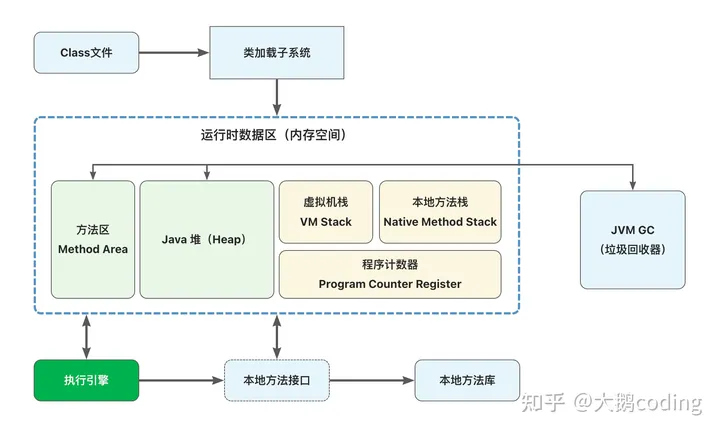
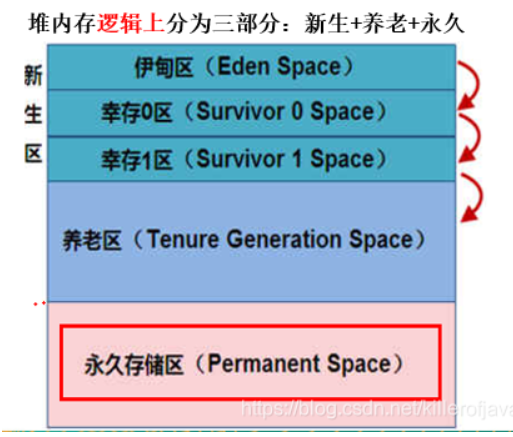

# JVM

JVM是Java Virtual Machine（Java虚拟机）的缩写，JVM是一个虚构出来的计算机，有着自己完善的硬件架构，如处理器、堆栈等。

## 代码的运行过程

1. **编译**
2. **解释**
3. **执行**

### java代码运行过程

Java代码首先被编译成中间代码（**javac**)，也就是字节码（.class文件），然后由**Java虚拟机（JVM）解释**和执行字节码。这种编译与解释的方式允许Java具有跨平台性，因为相同的字节码可以在不同操作系统上运行。

Java应用**程序运行在Java虚拟机**中，与底层操作系统解耦。这使得Java应用程序具有较高的可移植性，只需在不同平台上安装合适的JVM即可。

## JVM引擎

有多个JVM的实现，包括以下一些常见的：

1. **Oracle HotSpot JVM**：Oracle公司开发的HotSpot JVM是最流行的Java虚拟机实现之一。它包括了高度优化的JIT编译器，以及广泛用于生产环境的功能。
2. **OpenJDK JVM**：OpenJDK是一个开放源的Java开发工具包，它包括一个开源的Java虚拟机实现。Oracle的HotSpot JVM的一部分也是基于OpenJDK的。许多其他JVM实现都以OpenJDK为基础进行定制和扩展。
3. **IBM J9 JVM**：IBM开发的J9虚拟机是IBM WebSphere等商业应用中广泛使用的Java虚拟机实现。它在一些领域具有高度优化的性能和资源管理。
4. **Apache Harmony JVM**：Apache Harmony是一个Apache项目，旨在创建一个开源的Java运行时环境。尽管它没有达到官方的Java标准（Java SE规范），但它提供了一个可选择的JVM实现。
5. **GraalVM**：GraalVM是一种相对较新的JVM实现，由Oracle开发，支持多种语言，包括Java、JavaScript、Python等。它还提供了一个可以将不同语言混合使用的生态系统。

## jvm 体系结构

### 类加载器

Java虚拟机（JVM）区分三种类加载器是为了实现类加载的灵活性、隔离性和模块化。每种类加载器具有不同的加载范围和加载策略，这些差异有助于**管理和隔离不同类型的类**，**支持热部署、动态加载和模块化编程**等功能。

1. **启动类加载器**（Bootstrap Class Loader）：

   - 负责加载Java核心类，如java.lang.Object、java.lang.String等。这些类位于JVM的核心类库中。
   - 由JVM实现，通常是用本地代码实现的，不是Java类。
   - 加载范围最广，可以被所有其他类加载器访问。
   - 主要用于加载JVM自身的类和一些关键的系统类，不会加载应用程序的类。

2. **扩展类加载器**（Extension Class Loader）：

   - 负责加载Java的扩展类库，这些类库通常位于JRE扩展目录下（例如jre/lib/ext/）。
   - 可以通过设置系统属性扩展其搜索路径。
   - 加载范围介于启动类加载器和应用程序类加载器之间，通常用于加载JRE扩展类库。

3. **应用程序类加载器**（Application Class Loader）：

   - 负责加载应用程序的类，即开发人员自己编写的Java类。
   - 加载范围最窄，通常只加载应用程序类路径上的类。
   - 是大多数Java应用程序的类加载器，用于加载应用程序代码。

4. **自定义类加载器**：

   - 通过继承ClassLoader类并实现自定义的类加载逻辑来加载类。
   - 自定义类加载器可以用于实现各种加载策略，例如从网络、数据库或其他非标准位置加载类

   

### 方法区

方法区（Method Area 又称**永久代**）与Java堆一样，是各个线程共享的内存区域，它用于存储已被虚拟机加载的**类信息、常量、静态变量**、即时编译器**编译后的代码**等数据，即存放静态文件，如Java类、方法等。

方法区包含以下内容：

1. 类信息：方法区存储已加载的类的元数据，包括类的结构信息、字段描述、方法描述、父类和接口信息等。这些信息用于在运行时创建类实例和执行类的方法。
2. 常量池（Constant Pool）：常量池包含类中的常量，如字符串常量、基本数据类型常量等。这些常量用于类的初始化和运行时常量池解析。
3. 静态变量：类的静态变量（static fields）也存储在方法区中。这些变量是与类关联的，而不是与类的实例关联的，因此它们在所有实例之间共享。
4. 编译后的方法代码：Java源代码经过编译后，生成的字节码指令被存储在方法区中。这些字节码指令在运行时被解释或编译成本地机器代码。

### 堆

JVM（Java虚拟机）中的堆（Heap）是用于**存储对象实例**的内存区域。堆是Java应用程序**运行时数据**的主要存储区域之一，它包含了通过`new`关键字创建的**对象、数组和一些其他数据结构**。堆内存是在Java虚拟机启动时分配的，而且它的大小通常可以根据应用程序的需求进行调整（jvm调参）

#### 代 Generation

堆中的"代"是指在Java虚拟机中用于**管理对象的内存分配**和**提高垃圾回收的效率和减少内存管理的成本**而引入的概念。

1. 新生代（Young Generation）：新生代是堆的一部分，用于存储新创建的对象
2. 老年代（Old Generation）：老年代用于存储存活时间较长的对象。
3. 永久代（Permanent Generation，Java 7及之前的版本）或元数据区（Metaspace，Java 8及之后的版本）：这个区域用于存储类的元数据信息、字符串池和静态常量等。

### 虚拟机栈

Java虚拟机（JVM）的虚拟机栈是用于执行Java程序的内存区域之一。**虚拟机栈是线程私有的**，每个线程都有自己的虚拟机栈，用于**存储方法的局部变量、操作数栈、方法返回地址**等信息。

1. 栈帧（Stack Frame）：虚拟机栈由栈帧构成，每个方法在执行时都会创建一个栈帧，栈帧包含了方法的局部变量、操作数栈、方法返回地址等信息。
2. 局部变量表（Local Variable Table）：栈帧中的局部变量表用于存储方法的参数和局部变量，包括基本数据类型和对象引用。
3. 操作数栈（Operand Stack）：栈帧中的操作数栈用于执行方法的运算，它是一个后进先出（LIFO）的数据结构，用于存储运算时需要的数据。
4. 方法返回地址：每个栈帧中都包含方法的返回地址，用于在方法执行完毕后返回到调用该方法的地方。
5. 栈的深度：虚拟机栈的深度是有限的，当栈的深度超过其限制时，会抛出栈溢出异常（StackOverflowError）。
6. 栈帧的生命周期：栈帧的生命周期与方法的调用和返回密切相关。每当一个方法被调用，一个新的栈帧会被创建并压入虚拟机栈，方法执行完成后，该栈帧会被出栈并销毁。
7. 递归调用：递归方法是一种特殊情况，它会在虚拟机栈中创建多个相同方法的栈帧。递归调用可能导致栈溢出异常，因此需要谨慎使用

### 本地方法栈

本地方法栈（Native Method Stack）是Java虚拟机（JVM）中的另一个重要内存区域，与虚拟机栈有一些相似之处，但它用于执行本地方法（Native Method）或本地代码。本地方法是使用其他编程语言（如C、C++）编写的，通过Java Native Interface（JNI）与Java程序进行交互。

### 程序计数器 

 程序计数器（Program Counter Register）是一块较小的内存空间，它可以看作是当**前线程所执行的Java字节码的行号指示器**。在虚拟机的概念模型里，字节码解释器工作时就是通过改变这个计数器的值来选取下一条需要**执行的字节码指令，分支、循环、跳转、异常处理、线程恢复**等基础功能都需要依赖这个计数器来完成。

程序计数器（Program Counter，PC）在Java虚拟机中与操作系统中的PC（Processor Counter，处理器计数器）存在一些相似之处，但也有重要的区别：

1. 上下文：在操作系统中，PC通常指的是处理器寄存器，用于存储当前执行的机器指令的地址，以控制处理器的指令流。而在Java虚拟机中，程序计数器是一种虚拟机内部的数据结构，用于跟踪Java字节码指令的地址。
2. 范围：操作系统中的PC通常用于管理处理器执行的指令，而程序计数器是Java虚拟机的一部分，仅用于跟踪Java线程执行的字节码指令。
3. 独立性：程序计数器是Java虚拟机中每个线程独立拥有的，它在线程切换时，用于恢复线程的执行状态，确保线程可以从上次中断的地方继续执行。而操作系统中的PC通常是处理器级别的，多个线程共享同一个处理器的PC。
4. 内容：程序计数器存储的是Java字节码指令的地址，用于管理方法调用和返回，异常处理，以及线程切换。操作系统中的PC存储的是机器指令的地址，用于控制处理器的执行流。

## 直接内存

直接内存（Direct Memory），也叫堆外内存，它并不是虚拟机运行时数据区的一部分，也不是Java虚拟机规范中定义的内存区域，而是Java虚拟机的堆以外的内存，直接受操作系统管理。

## GC 垃圾回收机制

GC 说白了就是系统内存处理的过程，通过管理内存中的数据，确保java应用程序的稳定性与性能。

### 分代 策略

这是Java中最常见的策略之一。它将堆内存划分为两个或更多代，通常是年轻代和老年代。

1. **年轻代（Young Generation）：** 这是堆内存的一部分，通常用于存储新创建的对象。因为大多数新创建的对象很快就会变成垃圾，所以年轻代使用较快的垃圾收集策略，通常采用**复制（Copying）算法**。这个区域经常被清空，这有助于减少内存碎片。
2. **老年代（Old Generation）：** 老年代用于存储较长时间存活的对象，这些对象在年轻代中经历了多次垃圾收集。老年代的垃圾收集策略通常使用**标记-整理（Mark-Sweep-Compact）或标记-清除（Mark and Sweep）算法**，以最大程度地减少内存碎片并提高性能。

### 清除内存策略

#### 标记-清除 策略

它分为两个主要阶段：标记和清除。在标记阶段，垃圾收集器标记所有还存活的对象。在清除阶段，它清除所有未被标记的对象。标记-清除算法的一个缺点是会产生不连续的内存碎片。

#### 标记-整理 策略

这个策略是标记-清除的改进版本，它在标记阶段之后执行整理操作，将存活的对象移动到内存的一端，以消除内存碎片。

#### 复制 策略

复制算法将内存划分为两个区域，每次只使用其中一个。新对象首先分配到其中一个区域，当这个区域满了，垃圾收集器将存活对象从一个区域复制到另一个区域，然后清空原来的区域。这种方式减少了碎片，但需要额外的内存。

### 执行策略

#### 并行垃圾收集

 这个策略利用多线程来执行垃圾收集，以提高性能。它通常用于年轻代的垃圾收集，可以减少垃圾收集暂停时间。

并行垃圾收集策略旨在通过使用多个处理器核心或线程来提高垃圾收集性能，可以减少垃圾收集暂停时间。。以下是一些常见的并行垃圾收集策略：

1. **并行垃圾收集器（Parallel Garbage Collector）：** 也称为新生代并行收集器（Parallel Scavenge Collector），是一种以提高吞吐量为目标的垃圾收集器。它主要用于年轻代的垃圾收集，使用多线程来并行地进行垃圾收集操作。并行垃圾收集器旨在最大程度地利用多核处理器，以提高整体性能。
2. **Parallel Old收集器：** Parallel Old收集器是老年代的并行垃圾收集器，通常与年轻代的Parallel垃圾收集器一起使用。它使用多线程来并行执行标记和清除操作，以减少老年代垃圾收集的停顿时间。
3. **Parallel Compact收集器：** Parallel Compact收集器是一个老年代的垃圾收集器，它使用多线程来并行执行标记、整理和清除操作。它的主要目标是提高老年代垃圾收集的吞吐量。
4. **G1收集器（Garbage-First Collector）：** G1是一种结合了并行和并发策略的垃圾收集器，它执行并行的垃圾收集操作来提高性能。虽然它主要以低延迟为目标，但它仍然使用了并行处理来加速垃圾收集操作。
5. **Java Parallel Collector：** Java Parallel Collector是一种可以与旧版Parallel收集器一起使用的垃圾收集器，它专门为多核处理器设计，通过并行垃圾收集操作提高吞吐量。

#### 并发垃圾收集

并发垃圾收集策略旨在减少垃圾收集导致的停顿时间，以提高应用程序的响应性。以下是一些常见的并发垃圾收集策略：

1. **CMS收集器（Concurrent Mark-Sweep Collector）：** CMS是一种老年代并发垃圾收集器，它执行并发标记和并发清除操作以减少垃圾收集暂停时间。它适用于需要低延迟的应用程序，但可能会导致内存碎片问题。
2. **G1收集器（Garbage-First Collector）：** G1结合了并发和并行策略，它执行并发标记和并发清除操作，以减少垃圾收集暂停时间。它的设计目标是在大堆内存中提供可接受的低延迟性能。
3. **Z Garbage Collector（ZGC）：** ZGC是一种面向低延迟的并发垃圾收集器，它通过并发标记、并发压缩和并发重定位来最小化垃圾收集暂停时间。它适用于需要极低暂停时间的应用程序。
4. **Shenandoah收集器：** Shenandoah也是一种面向低延迟的并发垃圾收集器，它使用并发标记、并发清除和并发压缩来减少垃圾收集暂停时间。它的设计目标是在大堆内存中提供可接受的低延迟性能。
5. **Java Flight Recorder（JFR）：** 虽然不是一种垃圾收集器，但Java Flight Recorder是一种可以捕获和分析应用程序性能数据的工具，可以用于检测和分析垃圾收集暂停时间。它可以与其他垃圾收集器一起使用，以帮助优化垃圾收集性能。

